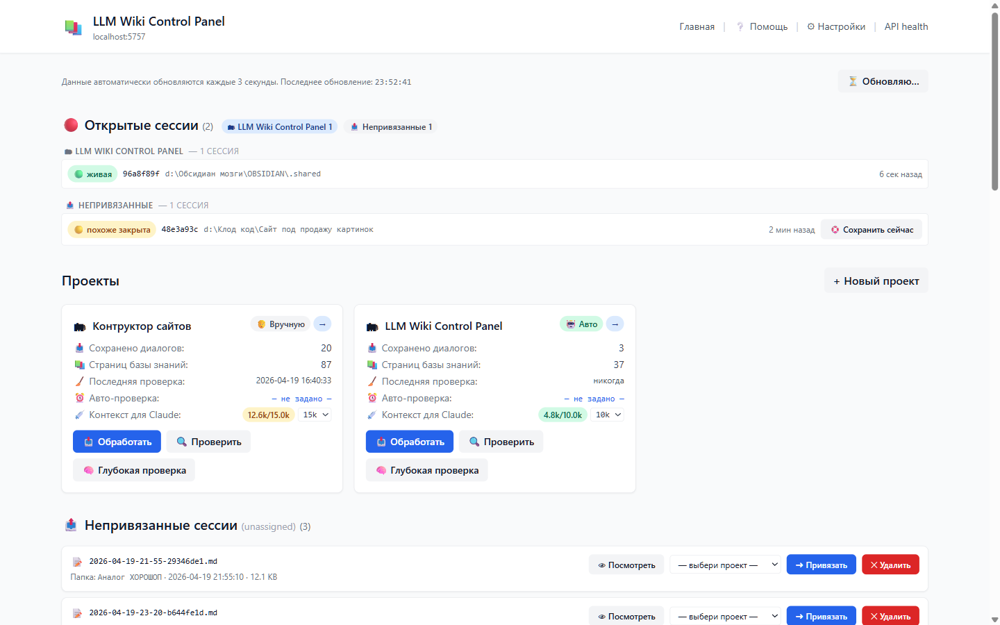

# LLM Wiki Control Panel

**Automatic persistent memory for Claude Code.** Turns every conversation with Claude into structured markdown pages of a growing personal wiki — so the next session starts with full context, not a blank slate.

Works on **Windows** and **macOS**. Fully local — your data never leaves your machine (except what Claude Code itself sends to the Anthropic API).



---

## ✨ What it does

- **Captures every Claude Code session automatically.** Session transcript → markdown in `<vault>/raw/chats/`.
- **Extracts knowledge.** Claude runs in a background subsession, reads the transcript, generates pages in `wiki/entities/`, `wiki/concepts/`, `wiki/sources/`, updates `index.md` and `log.md`.
- **Injects context into new sessions.** When you start Claude Code in a project folder, the wiki index + recent log are automatically added to Claude's context — Claude already knows what you discussed last time.
- **Web dashboard** at `http://localhost:5757` to browse projects, tweak settings, monitor operations, handle edge cases.
- **Obsidian-compatible.** The vault is a regular Obsidian vault — use Obsidian for reading/editing, graph view, mobile access.

### How it compares to chat history / "memory" features

| Approach | Data location | Cross-session memory | Structured | Works offline |
|---|---|---|---|---|
| Chat history in Claude Desktop | cloud | No (within one chat) | No | No |
| Claude Code `/resume` | `~/.claude/projects/` | Yes (single session) | No (raw transcript) | Yes |
| **This project** | your vault on disk | Yes (across all sessions, cross-topic) | Yes (wiki with graph) | Yes |

---

## 🧠 How it works in one diagram

```
     ┌───────────────┐
     │  Claude Code  │  (regular session)
     └───────┬───────┘
             │ SessionStart hook fires
             ▼
     ┌────────────────────────┐
     │  session-start.py      │
     │  • reads project-map   │
     │  • injects index + log │──→  Claude starts with context
     └────────────────────────┘
             ...
             │ /clear or close window
             ▼
     ┌────────────────────────┐
     │  session-end.py        │
     │  • saves transcript    │──→  <vault>/raw/chats/*.md
     │  • triggers ingest     │
     └───────┬────────────────┘
             │ (if auto_ingest=true)
             ▼
     ┌────────────────────────┐
     │  ingest.py (subsession)│
     │  • claude -p           │──→  <vault>/wiki/*.md + index.md + log.md
     └────────────────────────┘
             ▲
             │ browse / control
     ┌───────┴────────────────┐
     │  dashboard.py (Flask)  │  localhost:5757
     └────────────────────────┘
```

---

## 📦 Installation

Two ways: **automatic** (run one script) or **manual** (walk through each step yourself).

### 🤖 Option A: Let Claude Code install it

If you already have Claude Code CLI, just point it at this repo:

```bash
git clone https://github.com/YOUR_USERNAME/llm-wiki-control-panel.git
cd llm-wiki-control-panel
claude
```

Then say to Claude: **«Install this system»** (or «Установи эту систему»). Claude will read `CLAUDE.md` in the repo root and walk through the setup — asking for paths and confirming each step. The interactive `install.py` script handles everything (dependency check, pip install, project folder creation, hooks wiring, config generation).

### ⚙️ Option B: Run the installer yourself

```bash
# Clone
git clone https://github.com/YOUR_USERNAME/llm-wiki-control-panel.git
cd llm-wiki-control-panel

# Run installer
python install.py          # Windows
python3 install.py         # macOS / Linux
```

The script asks 2-3 questions (where to put the vault, project name), does the rest. After it finishes, start the dashboard — see section below.

### 🔧 Option C: Manual install, step by step

If the script doesn't work for your setup, or you want to understand what happens — follow the steps below.

### Prerequisites

| | Windows | macOS |
|---|---|---|
| **Python 3.12+** | [python.org](https://python.org) installer → ☑ Add Python to PATH | `brew install python` |
| **Node.js + npm** | [nodejs.org](https://nodejs.org) LTS | `brew install node` |
| **Claude CLI** | `npm install -g @anthropic-ai/claude-code` | `npm install -g @anthropic-ai/claude-code` |

Verify:
```bash
python --version        # 3.12 or higher
claude --version        # any recent version
```

### Install

**1. Clone this repo anywhere:**

```bash
git clone https://github.com/YOUR_USERNAME/llm-wiki-control-panel.git
cd llm-wiki-control-panel
```

**2. Install Python dependencies:**

```bash
# Windows
pip install -r requirements.txt

# macOS / Linux
pip3 install -r requirements.txt
```

**3. Create your vault folder structure.**

Pick a location for your knowledge base (example):

| Platform | Example path |
|---|---|
| Windows | `C:\Obsidian\My Project\` |
| macOS | `~/Obsidian/My Project/` |

Inside it, create these subfolders:
```
My Project/
├── raw/chats/
├── raw/articles/
├── raw/docs/
├── raw/assets/
├── wiki/entities/
├── wiki/concepts/
├── wiki/sources/
└── CLAUDE.md       (optional — rules for Claude in this project)
```

Or let the dashboard create them automatically when you add a new project (checkbox "Create structure").

**4. Configure project map.**

Copy the example:
```bash
cp config/project-map.example.json config/project-map.json
```

Edit `config/project-map.json` — replace `vault_base`, `vault_root`, `unassigned_root` with **absolute paths** matching your setup.

**5. Install hooks into Claude Code.**

Open `~/.claude/settings.json` (create if it doesn't exist). Add this block:

```json
{
  "hooks": {
    "SessionStart": [
      {
        "hooks": [
          {
            "type": "command",
            "command": "python /absolute/path/to/llm-wiki-control-panel/hooks/session-start.py"
          }
        ]
      }
    ],
    "SessionEnd": [
      {
        "hooks": [
          {
            "type": "command",
            "command": "python /absolute/path/to/llm-wiki-control-panel/hooks/session-end.py"
          }
        ]
      }
    ],
    "PreCompact": [
      {
        "hooks": [
          {
            "type": "command",
            "command": "python /absolute/path/to/llm-wiki-control-panel/hooks/pre-compact.py"
          }
        ]
      }
    ]
  }
}
```

Replace `/absolute/path/to/llm-wiki-control-panel/` with the actual path where you cloned this repo.

**On Windows** use `python` (not `python3`) and forward slashes in paths (Python handles them fine on Windows).

**6. Run the dashboard.**

| Windows | macOS |
|---|---|
| Double-click `start-dashboard.bat` | `chmod +x start-dashboard.command` then double-click in Finder |
| Or run `python scripts/dashboard.py` | Or run `python3 scripts/dashboard.py` |

Browser opens at `http://localhost:5757`.

**7. Verify hooks are registered.**

In a new terminal, start Claude Code in your vault folder:

```bash
cd "/path/to/your/vault"
claude
```

Type `/hooks` — you should see `SessionStart`, `SessionEnd`, `PreCompact` listed as registered.

Do a short conversation, then `/clear`. Check the dashboard: under "📥 Сохранённые диалоги" (Saved dialogs) your transcript appears as a markdown file.

---

## 🚀 Quick start

After installation:

1. **Start dashboard** — double-click `start-dashboard.bat` / `.command`
2. **Open Claude Code** in your vault folder — `cd /path/to/vault && claude`
3. **Work normally** — ask questions, write code
4. **`/clear` or close window** — transcript auto-saves to `raw/chats/`
5. **If auto-ingest is on** — wiki pages appear in 1-2 minutes

See [docs/GUIDE.md](docs/GUIDE.md) for the full user guide (screenshots, typical scenarios, troubleshooting, FAQ).

---

## 🔒 Privacy and security

- **Everything runs locally.** Dashboard listens on `127.0.0.1:5757` — not accessible from the network.
- **No auth.** Don't expose the dashboard publicly (don't change `host` to `0.0.0.0`, don't tunnel via ngrok without HTTP basic auth).
- **Your data stays on disk.** Only Claude Code itself sends your conversations to the Anthropic API — that's the standard Claude CLI behaviour, not this project.
- **Secrets warning.** If you show Claude an `.env` file, password, or API key in conversation, it ends up in `raw/chats/` and — if auto-ingest is on — in `wiki/`. Pages stay local, but the conversation itself already went to Anthropic. Hygiene: never paste secrets into chat; if you did, delete the transcript from `raw/chats/` immediately.
- **What's NOT committed to this repo:** your vault, your `project-map.json`, your logs, your backups. See [.gitignore](.gitignore).

---

## ⚙️ Architecture

- **Hooks** (`hooks/*.py`) — triggered by Claude Code on `SessionStart` / `SessionEnd` / `PreCompact` events.
- **Dashboard** (`scripts/dashboard.py`) — Flask web server on `localhost:5757`. Single-file, ~2000 lines.
- **Jobs tracker** (`scripts/lib/jobs.py`) — coordinates long-running operations (ingest, lint, import) between dashboard and hooks via `state/jobs.json` with filelock.
- **Transcript parser** (`scripts/lib/transcript.py`) — streaming JSONL → markdown conversion.
- **APScheduler** — cron-scheduled lint runs.
- **Frontend** — Alpine.js + TailwindCSS via CDN, no build step.

### Data flow

```
Claude Code session  →  hook dump  →  <vault>/raw/chats/
                                          │
                            (if auto_ingest=true)
                                          ▼
                                   ingest subsession
                                          │
                                          ▼
                             <vault>/wiki/ + index.md + log.md
                                          ▲
                                          │  reads
                                  Dashboard / Obsidian
```

---

## 📖 Documentation

- [**docs/GUIDE.md**](docs/GUIDE.md) — full user guide: screenshots, every UI element explained, typical scenarios, FAQ, troubleshooting
- [**docs/PRIVACY.md**](docs/PRIVACY.md) — detailed privacy and security notes
- [**docs/DEVELOPMENT.md**](docs/DEVELOPMENT.md) — architecture deep-dive, contribution guide

---

## 🧪 Quality

The codebase has regression audit scripts in `tests/`:

```bash
# Formal invariants (filelock, dedup, path traversal, kill_proc_tree, job lifecycle)
python tests/invariants.py

# Fuzz-tests of all API endpoints (~1200 requests with evil payloads)
python tests/fuzz_api.py

# Performance benchmarks (synthetic 500-page vault, 50MB JSONL parsing, HTTP load)
python tests/perf.py
```

All three should run clean — 0 invariant failures, 0 HTTP 5xx from fuzz.

---

## 🛠 Requirements

See [requirements.txt](requirements.txt):

- Flask 3.x — web server
- APScheduler 3.x — cron scheduler
- filelock 3.x — cross-process file locks
- psutil 5.x — memory monitoring (optional, used only by perf tests)
- requests 2.x — used only by tests

No compilation, no native dependencies. Pure Python.

---

## 🤝 Contributing

Issues and PRs welcome. See [docs/DEVELOPMENT.md](docs/DEVELOPMENT.md) for:

- Code style (minimal, no YAGNI, error handling at boundaries only)
- Running the test suite
- How to add a new feature / endpoint / page

---

## 📜 License

MIT — see [LICENSE](LICENSE).

---

## 🙏 Credits

- [Claude Code](https://github.com/anthropics/claude-code) — the CLI this system hooks into
- [Obsidian](https://obsidian.md) — markdown editor this vault is compatible with
- [Flask](https://flask.palletsprojects.com/) — minimal web framework powering the dashboard
- [Alpine.js](https://alpinejs.dev/) — reactivity in templates without a build step
