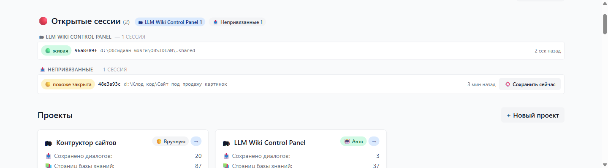
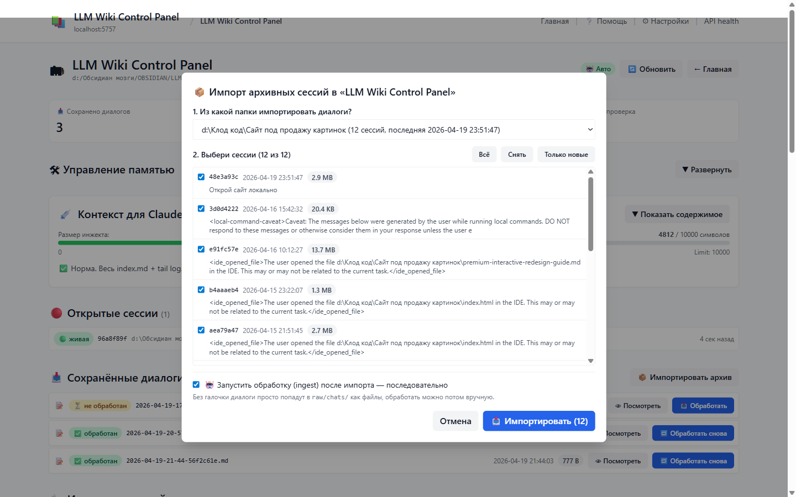
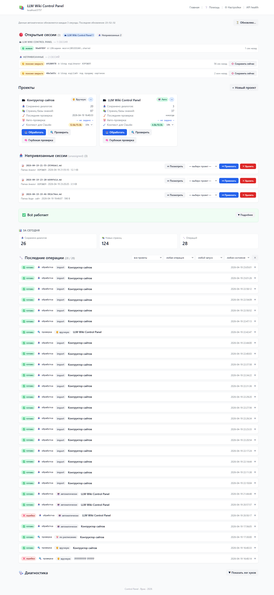
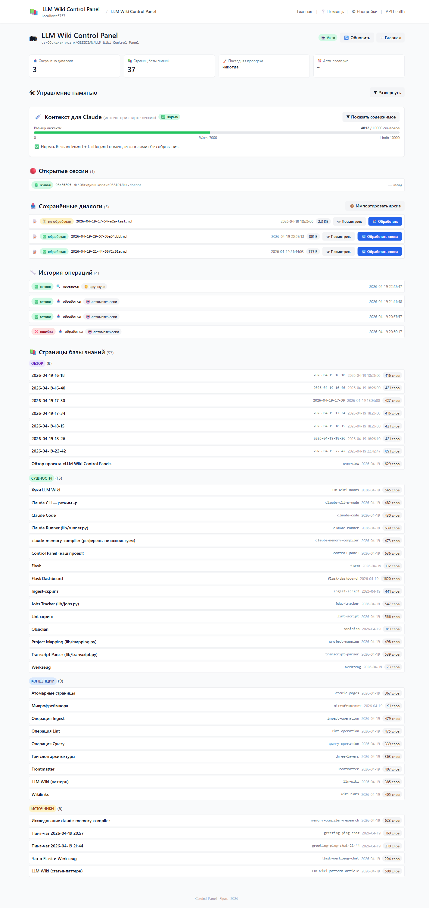
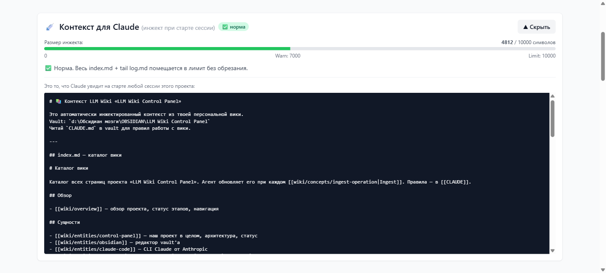
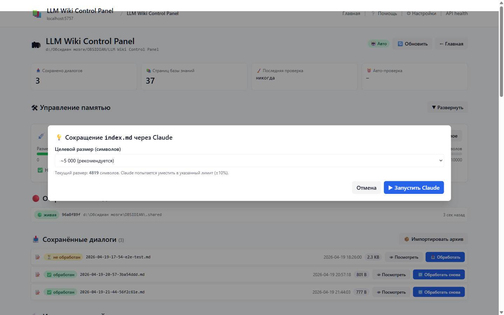

# 📖 Руководство: LLM Wiki Control Panel

Живое руководство. По шагам, с картинками, без технического жаргона. Если встретится непонятное слово — в конце есть [глоссарий](#-глоссарий).

---

## 🎯 Что это такое

Это система, которая превращает каждый твой разговор с Claude Code в упорядоченные заметки. Как если бы у Claude была память — он помнит, о чём вы говорили вчера.

**Простыми словами:**
- Ты поговорил с Claude в папке проекта.
- Система сама сохранила разговор.
- Сама вытащила из него важные идеи, факты, инструменты.
- Положила их в аккуратные страницы в твоей вики.
- В следующий раз Claude сразу видит всё, о чём вы договаривались.

**Что получаешь:**
- Не теряются идеи и решения из прошлых сессий
- При старте Claude уже знает контекст — не нужно каждый раз объяснять сначала
- База знаний растёт на диске, с графом связей между страницами
- Ничего не делаешь руками — всё происходит само


---

## ⚡ Быстрый старт (если всё уже установлено)

Три шага, чтобы начать пользоваться.

### 1. Запусти дашборд

| На Windows | На macOS |
|---|---|
| Двойной клик по ярлыку **«LLM Wiki Dashboard»** на рабочем столе | Двойной клик по файлу `.shared/start-dashboard.command`. Первый раз macOS может заблокировать → правый клик → **Open** → Confirm |

Откроется окно терминала и браузер на `http://localhost:5757`.

### 2. Работай в Claude Code как обычно

```bash
cd "путь/к/папке/проекта"
claude
```

Пишешь, спрашиваешь, кодишь. Когда закрываешь окно или пишешь `/clear` — разговор автоматически сохраняется в папку проекта.

### 3. Смотри что получилось

Через 1-2 минуты на странице проекта в дашборде появятся:
- Новый файл диалога в разделе **«📥 Сохранённые диалоги»**
- Если включена **🤖 Авто** — новые страницы в **«📚 Страницы базы знаний»**
- Запись в **«🔧 Последние операции»**

Всё. Остальное в этом гайде — справочник, читается по мере нужды.

---

## 🚀 Первый запуск (если ставим с нуля)

### Что нужно установить

| Компонент | Windows | macOS |
|---|---|---|
| **Python 3.12+** | [python.org](https://python.org) → Download → при установке **обязательно галочка «Add Python to PATH»** | `brew install python` (если нет Homebrew: [brew.sh](https://brew.sh)) |
| **Claude CLI** | `npm install -g @anthropic-ai/claude-code` | `npm install -g @anthropic-ai/claude-code` |
| **Библиотеки Python** | `pip install flask apscheduler filelock psutil requests` | `pip3 install flask apscheduler filelock psutil requests` |

### Создать ярлык запуска

| Windows | macOS |
|---|---|
| 1. Открыть папку `C:\Obsidian\.shared\` | 1. Открыть папку `~/Obsidian/.shared/` |
| 2. Правый клик по **`create-desktop-shortcut.ps1`** → **Выполнить с помощью PowerShell** | 2. В Terminal: `chmod +x start-dashboard.command` |
| 3. На рабочем столе появится **«LLM Wiki Dashboard»** | 3. Перетащить **`start-dashboard.command`** в Dock, либо запускать из Finder |

### Запустить и проверить

Двойной клик по ярлыку. В браузере откроется `http://localhost:5757`. Сверху слева должна быть плашка **«✅ Всё работает»**.

Если плашка красная или жёлтая → раздел [«Когда что-то не работает»](#-когда-что-то-не-работает).

### Как остановить

Закрыть окно терминала, которое открылось вместе с дашбордом. Браузер закрывать не обязательно — без сервера он просто покажет ошибку при обновлении.

---

## 📝 Как устроена память (главный концепт)

У каждого проекта есть **своя папка** на диске — она называется **vault** (хранилище). Внутри три области:

```
<vault>/
├── raw/         ← ИСТОЧНИКИ — сохраняются сюда, Claude читает и не меняет
│   ├── chats/    разговоры с Claude (автосохранение)
│   ├── articles/ статьи (через Web Clipper в Obsidian или вручную)
│   ├── docs/     PDF и длинные документы
│   └── assets/   картинки
│
├── wiki/        ← ЗНАНИЯ — Claude сам создаёт страницы на основе raw/
│   ├── entities/ сущности: инструменты, люди, сайты
│   ├── concepts/ идеи, принципы, методы
│   └── sources/  саммари источников
│
├── CLAUDE.md    ← правила проекта для Claude
├── index.md     ← оглавление вики
└── log.md       ← дневник операций
```

**Золотое правило:** `raw/` — нельзя трогать (Claude туда только пишет при сохранении и читает). `wiki/` — можно удалять страницы, Claude перегенерирует из `raw/` через кнопку **«📥 Обработать»**.

---

## 🖥 Где открывать Claude Code

В зависимости от того, что ты делаешь, Claude Code запускается в разной папке.

### Работа с базой знаний проекта

Например, обсуждаешь архитектуру, пишешь заметки, хочешь чтобы разговор автоматически попал в вики:

```bash
cd "C:/Obsidian/LLM Wiki Control Panel"   # Windows
cd "~/Obsidian/LLM Wiki Control Panel"                    # macOS
claude
```

### Править код самой системы (хуки, дашборд, скрипты)

```bash
cd "C:/Obsidian/.shared"   # Windows
cd "~/Obsidian/.shared"                    # macOS
claude
```

### И код системы, и вика одновременно

Когда правишь систему, но обсуждаешь изменения с учётом документации проекта:

```bash
cd "C:/Obsidian/LLM Wiki Control Panel"
claude --add-dir "../.shared"
```

### Любая другая папка

Запусти `claude` где угодно — сессия попадёт в раздел **«📤 Непривязанные»** в дашборде. Её можно потом прикрепить к любому проекту одной кнопкой.

---

## 🤖 Автоматический захват диалогов

### Как это работает

1. Ты запускаешь Claude Code в папке, подходящей под проект.
2. Работаешь как обычно.
3. Закрываешь окно Claude или вводишь `/clear` / `/logout`.
4. Невидимый автоматический обработчик **всегда** (даже в ручном режиме):
   - Читает `.jsonl`-транскрипт разговора
   - Превращает его в читаемый markdown
   - Сохраняет в `<vault>/raw/chats/YYYY-MM-DD-HH-MM-SS-<короткий-id>.md`

**Сам по себе этот шаг ещё не создаёт страниц в вики.** Он только сохраняет разговор как архив.

5. Что будет дальше — зависит от режима проекта:

| Режим | Что происходит дальше | Стоимость в токенах |
|---|---|---|
| **🤖 Авто** | Автоматически запускается обработка: Claude в фоне читает сохранённый диалог, создаёт страницы в `wiki/entities/`, `wiki/concepts/`, обновляет `index.md` и `log.md`. Новые страницы видны через 1-2 минуты. | ~10-40k токенов на каждый ингест |
| **🧑 Вручную** | Ничего не делает. Файл лежит в `raw/chats/` с бейджем **«⏳ не обработан»**. Хочешь знания — жмёшь **«📥 Обработать»** на карточке диалога. | 0 (пока не нажал) |

**Как менять режим:** на карточке проекта на главной странице — бейдж **🤖 Авто / 🧑 Вручную**. Клик переключает.

### Защита от потерянных диалогов (Backfill)

**Проблема:** в Claude Code VSCode Extension баг — команда `/clear` иногда не триггерит сохранение ([issue #50808](https://github.com/anthropics/claude-code/issues/50808)). Без защиты разговор бы пропал.

**Как защищает система:**
1. Каждый старт сессии система запоминает: «вот, сейчас в папке X работает сессия с id Y».
2. Когда ты следующий раз запускаешь Claude в той же папке — система проверяет: есть ли в реестре старые сессии, которых больше не существует?
3. Если есть — автоматически сохраняет их разговоры задним числом.

**Что это значит для тебя:** даже если VSCode схалтурил, твой разговор всё равно сохранится при следующем запуске Claude в этой же папке.

**Ограничения:**
- Записи старше 7 дней чистятся без попытки сохранения
- Разговор появится только при следующем старте Claude в той же папке, не раньше

### Защита от двойного сохранения (Dedup)

Если автоматика сохранения сработала дважды (например, и Backfill, и нормальное закрытие) — второе сохранение пропускается. Работает окно **5 минут**: одна сессия = один файл, никогда не дубли.

### Сохранение до команды `/compact`

Когда Claude сжимает свой контекст командой `/compact` — он теряет часть деталей. Чтобы они не пропали:
- Прямо перед `/compact` срабатывает отдельный обработчик (pre-compact)
- Он сохраняет **актуальный**, ещё-не-сжатый разговор в `raw/chats/` с суффиксом `-precompact`
- Обычное сохранение при закрытии сессии потом добавляется отдельно (уже сжатый контекст)

**Полезно когда:** после `/compact` Claude что-то «забыл» — можно открыть pre-compact-файл в vault и найти этот контекст.

### Кнопка «🛟 Сохранить сейчас»

Если не хочешь ждать следующего старта Claude, чтобы Backfill сработал:

- На главной в секции **«🔴 Открытые сессии»** у закрытых сессий (🟡) — кнопка **«🛟 Сохранить сейчас»**
- Для привязанных к проекту — сразу сохраняет в `<vault>/raw/chats/`
- Для непривязанных — спрашивает куда сохранить



---

## 📦 Импорт старых диалогов

Если у тебя накоплены разговоры с Claude в других папках (не привязанных к проектам) — можно их массово затащить в проект.

### Пошагово

1. Открыть страницу проекта (клик по названию на главной).
2. В секции **«📥 Сохранённые диалоги»** — кнопка **«📦 Импортировать архив»**.
3. Откроется диалог со списком всех папок `~/.claude/projects/` на твоём диске:
   - У каждой папки показано: рабочий путь (cwd), количество сессий, дата последней.
4. Выбираешь папку — появляется список транскриптов:
   - Чекбокс, превью первой реплики пользователя, дата, размер
   - Бейдж **«✅ уже импортирован»** — если файл уже есть в этом проекте
5. Опции:
   - **«Всё / Снять / Только новые»** — массовый выбор
   - **«🤖 Запустить обработку после импорта»** — сразу сделать ingest каждому (ВНИМАНИЕ: 20 сессий × 30k токенов ≈ значительный расход)
6. **«📥 Импортировать (N)»** — запускает в фоне.



### Что происходит при импорте

- Каждый `.jsonl` конвертируется в markdown и кладётся в `<vault>/raw/chats/`
- Дубли не создаются (если файл с таким id уже есть — пропускается)
- Исходники в `~/.claude/projects/` остаются — Claude Code продолжит их использовать для `/resume`
- Если включена обработка — ingest запускается **один за другим**, не параллельно (чтобы не выжечь лимит)

### Прогресс

Сверху страницы проекта появится баннер:

```
⏳ Идёт массовый импорт · 3 из 20 · пропущено 1 · ошибок 0  [🤖 + обработка]
████████░░░░░░░░░░░░░░░░░░░░░░░░░░░░
Сейчас: 2026-04-15-11-22-abc12345.md
```

Обновляется каждые 5 секунд. При завершении — toast в углу: «✅ Импорт завершён».

### Совет

**Для первого знакомства:** импортируй **без** галочки «Запустить обработку». Сначала посмотри что вообще импортировалось, потом обрабатывай руками только те диалоги, которые реально содержат ценную информацию. Иначе уйдёт 300-600k токенов за одну кнопку.

---

## 🎛 Главная страница дашборда

URL: `http://localhost:5757/`



### Что на странице, по блокам

**1. Панель обновления (сверху):**
- Кнопка **🔄 Обновить** (ручное обновление)
- Время последнего обновления
- Автообновление идёт каждые 3 секунды — сам не трогай

**2. 🔴 Открытые сессии:**
- Все активные и недавно закрытые сессии Claude
- Сгруппированы по проектам
- **🟢 живая** = транскрипт обновлялся за последние 30 секунд
- **🟡 похоже закрыта** = транскрипт давно не менялся (возможно /clear в VSCode)
- У жёлтых — кнопка **🛟 Сохранить сейчас**

**3. Проекты — карточки:**
- Название + путь к vault
- Переключатель **🤖 Авто / 🧑 Вручную** — клик по бейджу
- Счётчики: сколько сохранено диалогов, сколько страниц знаний
- Последняя проверка и авто-проверка по расписанию
- Индикатор **💉 Контекст для Claude** — сколько символов попадает Claude при старте сессии
- Dropdown лимита: 5k / 10k / 15k / 20k / 25k (настраивается на каждый проект)
- Кнопки:
  - **📥 Обработать** — запустить ingest вручную
  - **🔍 Проверить** — запустить lint (быстрая проверка ссылок)
  - **🧠 Глубокая проверка** — lint + семантический анализ через Claude (медленно, дорого)

**4. ⏰ Авто-проверки по расписанию:**
- Список проектов с настроенным cron-расписанием и следующий запуск

**5. 📤 Непривязанные сессии (unassigned):**
- Сессии из папок, не покрытых никаким проектом
- **👁 Посмотреть** — превью первых 2000 символов диалога
- **➜ Привязать** к проекту — файл физически переедет в `<vault>/raw/chats/`
- **✕ Удалить**

**6. ✅ Всё работает — статус:**
- **✅** — всё ок
- **⚠️** — есть замечания (напр., хуки долго не срабатывали)
- **🚨** — есть проблемы (напр., падения хуков за сутки)
- Клик **«▼ Подробнее»** — раскрывает 4 проверки

**7. 📊 За сегодня:**
- Сколько диалогов сохранено, новых страниц, операций

**8. 🔧 Последние операции:**
- Лента ingest/lint с фильтрами: проект, тип, запуск, состояние
- Клик по строке разворачивает детали (stdout, stderr, exit code)

**9. 🩺 Диагностика:**
- Раскрываемая секция с последними строками лога автоматики (`hook-log.txt`)

### Всплывающие уведомления (toast)

Сообщения появляются в правом нижнем углу:

| Цвет | Что значит | Живёт |
|---|---|---|
| 🟢 ok | успех | 4 секунды |
| 🔵 info | нейтральное | 4 секунды |
| 🟡 warn | предупреждение | 4 секунды |
| 🔴 error | ошибка | 8 секунд |

Каждый можно закрыть вручную крестиком **✕**.

---

## 🗂 Страница проекта

URL: `http://localhost:5757/project/<имя>`

Открывается по клику на название проекта или кнопку **→** на карточке.



### Что на странице

**1. Заголовок** — имя проекта, путь, бейдж режима, кнопки **🔄 Обновить** и **← Главная**.

**2. Статистика** — 4 карточки: сохранено диалогов, страниц знаний, последняя проверка, авто-проверка.

**3. 🛠 Управление памятью** — кнопка **▼ Развернуть**, там инструменты сокращения контекста ([раздел ниже](#-инструменты-сокращения-памяти)).

**4. 💉 Контекст для Claude** — что именно подгружается в каждую новую сессию. Можно развернуть превью.

**5. 🔴 Открытые сессии** — живые сессии именно этого проекта.

**6. 📥 Сохранённые диалоги** — список файлов в `raw/chats/`:
- **✅ обработан** / **⏳ не обработан**
- **👁 Посмотреть** — превью
- **📥 Обработать** / **🔁 Обработать снова**
- **🗑 Удалить**
- Сверху секции: **📦 Импортировать архив**

**7. 🔧 История операций** — операции только этого проекта.

**8. 📚 Страницы базы знаний** — сгруппированы по типу (сущности, концепции, источники). У каждой: имя, дата обновления, количество слов.

---

## ⚙ Настройки и маппинг проектов

URL: `http://localhost:5757/settings`

### Что здесь

- Создать / удалить проект
- Редактировать **cwd_patterns** — шаблоны путей, по которым Claude понимает «это сессия в проекте X»
- Редактировать промпты Claude (ingest, lint, optimize)

### Создать проект

Кнопка **«+ Новый проект»** → форма:

| Поле | Что это | Пример |
|---|---|---|
| **Имя проекта** | Любой текст, отображается в дашборде | «Мой проект» |
| **📁 Папка базы знаний** (`vault_root`) | Абсолютный путь. Здесь будут `raw/` и `wiki/` | Win: `d:/OBSIDIAN/Мой проект`<br>Mac: `/Users/user/OBSIDIAN/Мой проект` |
| **🎯 Какие папки относятся к проекту** (`cwd_patterns`) | Список шаблонов | `*/мой-проект`, `*/мой-проект/*` |
| **🤖 Авто-обработка новых диалогов** | Включить автоматический ingest | checkbox |
| **📂 Создать структуру папок** | Автоматически создать `raw/{chats,articles,docs,assets}` и `wiki/{entities,concepts,sources}` | checkbox |

**Что такое `cwd_patterns`:** когда ты запускаешь Claude в какой-то папке, её путь сверяется со всеми шаблонами всех проектов. Первое совпадение — сессия попадает в этот проект.

Примеры:
- `*/мой-проект` — точное совпадение имени папки
- `*/мой-проект/*` — все подпапки внутри
- `*мой-проект*` — любое место в пути, где встречается эта строка
- `D:/work/*` — все сессии из `D:/work/` на Windows
- `/Users/user/work/*` — все из `~/work/` на mac

### Удалить проект

Кнопка **«✕ Удалить из списка»** убирает запись в системе. **Папку на диске не удаляет** — это защита от случайного удаления. Если хочешь стереть всё — удали папку руками.

### Редактор промптов

Промпты — инструкции, которые Claude получает при обработке и проверке. Файлы в `.shared/prompts/*.md`.

| Файл | Зачем |
|---|---|
| `ingest-ru.md` | Как Claude должен разбирать сохранённый диалог на страницы |
| `lint-semantic-ru.md` | Как искать противоречия между страницами |
| `optimize-index-ru.md` | Как сокращать большие `index.md` / `log.md` |

Перед каждым сохранением автоматически создаётся бэкап `*.md.bak` — можно откатить.

**Переменные в промптах:**
- `%%PROJECT_NAME%%` — имя проекта
- `%%VAULT_ROOT%%` — путь к vault
- `%%SOURCE_FILE%%` — путь к источнику (только в ingest)
- `%%TODAY%%` — сегодняшняя дата

---

## 🧠 Контекст для Claude

### Что это

При старте каждой сессии Claude автоматический обработчик собирает текст из трёх частей и передаёт его Claude **сразу** — он видит его при первом промпте, без `Read`-вызовов.

**Что попадает в Claude (по порядку):**

1. **Шапка инжекта** (~200 символов):
   ```
   # 📚 Контекст LLM Wiki «<имя проекта>»

   Это автоматически инжектированный контекст из твоей персональной вики.
   Vault: `<путь>`
   Читай `CLAUDE.md` в vault для правил работы с вики.
   ```
   Именно из-за шапки Claude «знает», что нужно читать `CLAUDE.md` за правилами.

2. **Весь `index.md`** — оглавление вики.

3. **Хвост `log.md`** — последние **30 строк** (именно строк, не записей; длинная запись может обрезаться).

### Когда инжект не работает

Claude запустится без контекста в трёх случаях:

| Ситуация | Что происходит |
|---|---|
| **Непривязанная сессия** — папка не матчится ни на один проект | Инжект пропускается. Сессия попадёт в «📤 Непривязанные». До привязки Claude не узнает про вики. |
| **Сабсессия** — система сама запустила Claude (ingest/lint) | Инжект пропускается специально, чтобы избежать бесконечной петли. |
| **Vault не существует** — `vault_root` из настроек указывает на удалённую папку | Инжект молча пропускается, пишется в `hook-log.txt`. |

### Что при обрезке

Если всё вместе (шапка + `index.md` + хвост `log.md`) не влезает в лимит — обрезается **целиком по лимиту**, не по частям. Если `index.md` сам больше лимита, `log.md` вообще не попадёт.

В конец обрезанного инжекта добавляется маркер: `… [контекст обрезан по лимиту 10k]`. По нему Claude понимает, что видит неполный контекст.

### Индикатор размера

На карточке проекта бейдж **💉 Контекст для Claude**:

| Цвет | Значение | Что делать |
|---|---|---|
| 🟢 Зелёный | меньше 70% лимита | Норма |
| 🟡 Жёлтый | 70-100% лимита | Уже многовато |
| 🔴 Красный | ≥ 100% лимита | **Часть обрезается** — пора сократить ([инструменты ниже](#-инструменты-сокращения-памяти)) |

### Per-project лимит

У каждого проекта свой лимит. Меняется dropdown'ом на карточке. Значения: **5k / 10k / 15k / 20k / 25k символов**.

- **Когда поднять:** большая база знаний, Claude теряет часть контекста из-за обрезки
- **Когда опустить:** Claude не использует большую часть инжекта — экономим токены на каждой сессии

### Превью

На странице проекта в секции **💉 Контекст для Claude** — кнопка **«▼ Показать содержимое»**. Показывает ровно тот текст, который увидит Claude при старте.



---

## 🛠 Инструменты сокращения памяти

Когда красный индикатор — открой на странице проекта блок **«🛠 Управление памятью»**. Четыре инструмента, от безопасного к сложному.

### 🧹 Архивирование log.md

**Что делает:** оставляет в `log.md` последние N записей, остальные переносит в `log-archive.md`.

**Когда использовать:** первым делом, если инжект переполнен. Безопасно — все данные просто в другом файле. Claude при старте не увидит архив в инжекте, но может прочитать `log-archive.md` по запросу.

**Диалог:** выбор «оставить 5 / 10 / 15 / 20 / 30 / 50 последних записей». Side-by-side предпросмотр показывает, что уедет в архив:

```
📦 Уедут в log-archive.md (7)  │  ✅ Останутся в log.md (10)
───────────────────────────────┼──────────────────────────
(450) [2026-04-01] setup      │  (680) [2026-04-15] ingest
(320) [2026-04-03] ingest     │  (530) [2026-04-16] refactor
```

Числа в скобках — размер записи в символах.

### 💡 Предложить сокращения через Claude

**Что делает:** запускает Claude с задачей «сократи файл до N символов, сохрани смысл». Показывает предпросмотр до/после.

**Когда использовать:** простое архивирование не помогло, а разбивать индекс ещё рано.

**Риски:**
- Claude может неверно оценить важность
- Результат каждый раз разный
- **Читай предпросмотр внимательно** перед применением

**Стоимость:** ~10-20k токенов за запуск.



### 📂 Разбиение index.md на под-индексы

**Что делает:** разделяет `index.md` на три файла:
- `index-entities.md` — сущности
- `index-concepts.md` — концепции
- `index-sources.md` — источники

Корневой `index.md` становится короткой навигационной страницей со ссылками на под-индексы.

**Когда использовать:** когда в проекте **500+ страниц**, и никакое сокращение не помогает.

**Плюсы:** инжект резко уменьшается, база масштабируется до тысяч страниц.

**Минусы:** Claude в новой сессии не видит все страницы сразу — когда нужна конкретная, делает дополнительный `Read` на под-индекс.

**Обратимость:** кнопка **«🔀 Слить обратно»** соединяет под-индексы в один `index.md` и удаляет их.

### 💾 Резервные копии

Перед каждой деструктивной операцией в `<vault>/.backups/<timestamp>-<операция>/` сохраняется копия затронутых файлов.

Список всех бэкапов — в секции **«💾 Резервные копии»**: дата, операция, размер. У каждого:
- **↶ Восстановить** — вернёт файлы. **Сначала автоматически создаёт копию `pre-restore-...`** — на случай, если откат тоже не нужен.
- **✕** — удалить бэкап навсегда.

### Автоочистка бэкапов

Чтобы `.backups/` не рос бесконечно, работает автоочистка:

**Бэкап удаляется если выполнены ОБА условия:**
1. Старше **30 дней**
2. Не в **топ-10 самых свежих** для своей операции

Примеры:
- 3 бэкапа archive-log за год → ничего не удалится (меньше 10)
- 15 бэкапов archive-log, 5 свежих + 10 старше месяца → удалятся 5 старых
- 50 бэкапов optimize-index за год → останется 10, 40 удалятся

**Запускается:** автоматически после каждого нового бэкапа; вручную кнопкой **«🧹 Автоочистка»**.

**Что НЕ чистится никогда:** `raw/chats/`, `wiki/`, `log.md`, `log-archive.md`, `index.md`, служебные файлы системы, `.bak` промптов, исходные `.jsonl` от Claude Code.

---

## 🔍 Проверка базы знаний (Lint)

Находит проблемы, которые накапливаются в большой базе.

### 6 быстрых проверок (без Claude)

1. **Broken wikilinks** — ссылки на несуществующие страницы
2. **Orphan pages** — страницы без входящих ссылок
3. **Stale pages** — источник обновился, страница не перегенерирована
4. **Missing backlinks** — есть `A → B`, нет обратной `B → A`
5. **Sparse pages** — менее 200 слов (слабо раскрытая тема)
6. **Orphan sources** — файл в `raw/`, не попавший ни в одну wiki-страницу

### 7-я медленная проверка (через Claude)

**Contradictions** — ищет противоречия между страницами. Запускается Claude, стоит ~20-60k токенов.

### Как запустить

**Разово:**
- На карточке проекта **🔍 Проверить** — быстрая (без семантики)
- **🧠 Глубокая проверка** — с семантической

**По расписанию:**
- На карточке клик по **⏰ Авто-проверка** → wizard:
  - Каждый день в HH:MM
  - Раз в неделю в <день> в HH:MM
  - Каждые N часов
  - Своё cron-выражение

Результат сохраняется в `<vault>/wiki/lint-reports/YYYY-MM-DD-HH-MM-SS.md`.

---

## 🩺 Когда что-то не работает

### Плашка статуса красная или жёлтая

На главной раскрой **«▼ Подробнее»** → 4 проверки:

| Проверка | Если красная/жёлтая | Что делать |
|---|---|---|
| **Хуки Claude Code зарегистрированы** | Автоматика не подключена | Проверить `~/.claude/settings.json` — должны быть блоки `SessionStart`, `SessionEnd`, `PreCompact` |
| **Хуки срабатывают** | Давно не срабатывали | Если запускал Claude, но нет — смотри `hook-log.txt` |
| **Карта проектов загружена** | Файл битый или пустой | Открыть `.shared/config/project-map.json` в редакторе, проверить синтаксис JSON |
| **Падения за 24ч** | Есть ошибки в логе | Показывается количество и последнее сообщение |

### Автоматика не срабатывает

Открой `.shared/state/hook-log.txt` — там каждый вызов логируется. В дашборде: на главной **«🩺 Диагностика» → «▼ Показать лог хуков»**.

Если за последнюю сессию — тишина:
- В Claude Code введи `/hooks` — должен показать зарегистрированные хуки
- Проверь `~/.claude/settings.json` — есть ли блоки хуков
- Если использовал VSCode Extension и `/clear` — там баг, backfill подхватит при следующем старте

### Дашборд не запускается

| Windows | macOS |
|---|---|
| `netstat -an \| findstr 5757` — проверить свободен ли порт | `lsof -i :5757` — то же |
| Посмотреть вывод в окне терминала — там stack trace | То же |
| Запустить вручную: `python .shared\scripts\dashboard.py` | `python3 .shared/scripts/dashboard.py` |

### Ingest закончился с ошибкой

В ленте **«🔧 Последние операции»** разверни failed-строку → смотри `stdout_tail` и `stderr_tail`.

Частые причины:
- Источник очень большой (>60k символов — обрезается до 60k)
- Проблема с самим `claude` — проверь `claude --version`
- Нет интернета
- Лимит API исчерпан

### Много «missing backlinks» в lint

Это **не ошибка**, а **предложение**. В большинстве случаев одностороннняя связь уместна (например, «источник → саммари» не требует обратной). Пройдись глазами и добавляй обратную связь только там, где она реально по смыслу.

---

## 📂 Где что лежит

### Корневая папка (одна на весь компьютер)

```
OBSIDIAN/                            ← корневая папка всей системы
│
├── LLM Wiki Control Panel/          ← vault с описанием самой системы
├── <Другие проекты>/                ← например, «Another Project»
├── .unassigned/                     ← сессии без привязки к проекту
└── .shared/                         ← КОД системы (общий для всех проектов)
```

### Внутри `.shared/` (код системы)

```
.shared/
├── hooks/                     ← автоматические обработчики событий Claude
│   ├── session-start.py       запуск сессии
│   ├── session-end.py         закрытие сессии
│   └── pre-compact.py         перед /compact
│
├── scripts/
│   ├── dashboard.py           веб-сервер дашборда (Flask)
│   ├── ingest.py              обработка источников
│   ├── lint.py                проверка базы знаний
│   └── lib/                   общие вспомогательные модули
│
├── prompts/                   промпты для Claude
├── dashboard/                 HTML/CSS/JS для веб-интерфейса
├── config/project-map.json    список проектов и где они лежат
├── state/                     оперативное состояние системы
│   ├── hook-log.txt           лог автоматики
│   ├── jobs.json              история операций
│   ├── session-dumps.json     защита от двойного сохранения
│   └── active-sessions.json   реестр живых сессий
│
├── tmp/audit/                 скрипты для регрессионных проверок
│   ├── invariants.py          формальные инварианты
│   ├── fuzz_api.py            fuzz-тесты API
│   └── perf.py                бенчмарки
│
├── start-dashboard.bat        запуск на Windows
├── start-dashboard.command    запуск на macOS
└── create-desktop-shortcut.ps1 создание ярлыка (Windows)
```

### Внутри каждого vault (база знаний проекта)

```
<vault>/
├── raw/                  источники (read-only для системы)
│   ├── chats/             сохранённые разговоры
│   ├── articles/          статьи
│   ├── docs/              PDF
│   └── assets/            картинки
│
├── wiki/                 страницы, созданные Claude
│   ├── entities/          сущности
│   ├── concepts/          концепции
│   ├── sources/           саммари источников
│   └── lint-reports/      отчёты проверок
│
├── .backups/             снапшоты перед деструктивными операциями
├── CLAUDE.md             правила проекта для Claude
├── GUIDE.md              это руководство
├── index.md              оглавление вики (инжектится Claude)
├── log.md                журнал операций (хвост инжектится)
└── log-archive.md        архивные записи log.md (появляется после архивирования)
```

---

## 💡 Типичные сценарии

### Сценарий 1 — Исследование новой темы

1. Сохрани несколько статей в `<vault>/raw/articles/` (через Web Clipper в Obsidian или вручную).
2. На странице проекта у каждой — кнопка **📥 Обработать** → создаёт страницы в `wiki/`.
3. Альтернатива: начни разговор про тему с Claude в нужной папке при включённой **🤖 Авто** → ingest сработает сам после закрытия.
4. Через день посмотри граф в Obsidian — виден кластер связанных страниц.

### Сценарий 2 — Запомнить решение из рабочей сессии

1. Открой Claude в папке проекта, работай как обычно.
2. При `/clear` или закрытии разговор сохранится автоматически.
3. Auto-ingest выделит решения как страницы.
4. Через неделю спроси Claude: «что мы решили по X?» — он найдёт и расскажет.

### Сценарий 3 — Переполнен инжект

**Видишь на карточке:** **💉 Контекст для Claude** красный, пишет `12619 / 10000 символов · обрезается`.

По порядку:
1. Подними лимит до 15k / 20k через dropdown
2. Если снова красный — **🧹 Архивировать log.md** (оставь 10-20 записей)
3. Если и это не хватает — **💡 Предложить сокращения через Claude** для `index.md`
4. Если больше 500 страниц — **📂 Разбить index.md** на под-индексы

### Сценарий 4 — Перетащить старые разговоры в проект

1. Открой страницу проекта.
2. В секции **«📥 Сохранённые диалоги»** — **«📦 Импортировать архив»**.
3. Выбери папку Claude Code (из другого места, где велись разговоры).
4. Отметь нужные сессии (по умолчанию все ещё не импортированные).
5. **Без галочки** «Запустить обработку» — сначала импортируй физически.
6. Потом постепенно нажимай **📥 Обработать** на каждой ценной.

### Сценарий 5 — Откат после неудачной оптимизации

1. Результат Claude-оптимизации не нравится.
2. В **💾 Резервные копии** найди копию `optimize-index-<дата>`.
3. **↶ Восстановить** — вернёт файл. Автоматически создаётся `pre-restore-...`, если потребуется откатить откат.

---

## ❓ FAQ

### Как переименовать проект?

1. Открой `.shared/config/project-map.json` в редакторе — поменяй `"name"`.
2. Если хочешь и папку на диске переименовать — обнови `"vault_root"` в той же записи.
3. Перезапусти дашборд.

Все страницы, диалоги, лог — на месте.

### Как удалить проект целиком?

1. В `/settings` → **✕ Удалить из списка** рядом с проектом. Это уберёт запись системы, **папку на диске не тронет**.
2. Папку удали вручную через проводник/Finder.

### Как посмотреть расход токенов?

В системе учёта нет. Но:
- **`/cost`** в терминале Claude Code — расход текущей сессии.
- **На сайте Anthropic Console** — статистика за день/месяц по всем сессиям, включая ingest и lint.
- **В ленте «🔧 Последние операции»** — длительность каждого. Примерно: **1 минута работы `claude -p` ≈ 10-20k токенов**.

### Как сделать бэкап всей базы?

Скопируй папку vault (например, `LLM Wiki Control Panel/`) на внешний диск или в облако. Внутри всё: `raw/`, `wiki/`, `CLAUDE.md`, `index.md`, `log.md`. Больше ничего копировать не нужно.

Бэкапы внутри `.backups/` — локальные, для отката конкретных операций, не заменяют полный бэкап.

### Можно ли запустить два дашборда параллельно?

Нельзя на одном порту. Если очень нужно — во второй копии кода поменять 5757 на 5758. **Но не стоит:** оба дашборда будут писать в один `.shared/state/`, получится каша.

### Vault в iCloud / Dropbox — нормально?

Работает, но с оговорками:
- Синхронизация **медленная**. Облачный клиент блокирует файл на время заливки → хук может упереться в тайм-аут.
- `.backups/` раздувают трафик. Добавь папку в ignore синхронизации.
- Mobile Obsidian читает vault нормально — там обычный markdown.

Рекомендация: **vault'ы — локально на SSD, руками бэкапить в облако раз в неделю**.

### Как откатить плохой ingest?

1. **Через бэкап:** в `.backups/` есть копия `index.md`, `log.md` до ingest. **↶ Восстановить**.
2. **Удалить страницы вручную** в Obsidian или в дашборде (кнопка **🗑 Удалить** у чата удалит файл диалога; страницы в `wiki/` — удалять в Obsidian или проводнике).
3. **Перегенерировать:** удали плохие страницы → нажми **🔁 Обработать снова** на том же диалоге.

### Obsidian не видит новые файлы, которые создаёт система

Obsidian кэширует список файлов при открытии vault. Если файл создан, пока Obsidian был открыт:
- `Ctrl + Shift + R` (на macOS: `Cmd + Shift + R`) — Reload Vault without saving.
- Или переключиться в другую папку и обратно.

### Claude в новой сессии не видит прошлую работу

Проверь по порядку:
1. На карточке проекта индикатор **💉 Контекст для Claude** — что за значение?
2. Нажми **«▼ Показать содержимое»** — это буквально то, что увидит Claude при старте.
3. Если пустое — `index.md` и `log.md` проекта пусты, ingest ни разу не запускался.
4. Если есть, но Claude «не помнит» — проверь что Claude запущен в папке, матчащейся на `cwd_patterns` проекта. В `/settings` — посмотри шаблоны проекта.

---

## 🔒 Приватность и безопасность

### Куда уходят данные

**В Anthropic API уходит:**
- Содержимое каждой сессии Claude Code (это стандартно для CLI, не специфично для системы)
- Инжект контекста (`index.md` + хвост `log.md`) при **каждом** старте
- Содержимое файлов при каждом ingest или семантическом lint

**Никуда не уходит:**
- Содержимое `<vault>/raw/` пока по нему не запущен ingest
- `.backups/`, `.shared/state/`, любые служебные файлы системы
- Пароли/ключи/конфиги — если сам не показал их Claude в диалоге

### Внимание к секретам

Если ты показал Claude `.env`, пароли БД, API-ключи — **они попадут в транскрипт** в `raw/chats/`, потом при ingest — в `wiki/`. Страницы останутся локально на диске, но **сам диалог уже ушёл в Anthropic API**.

**Гигиена:**
- Не вставлять секреты открытым текстом в чат
- Если вставил — удали файл диалога из `raw/chats/` (**🗑 Удалить** в дашборде). Транскрипт в `~/.claude/projects/*.jsonl` удали тоже вручную.
- В `.gitignore` vault'а должны быть: `.shared/state/`, `.backups/`

### Dashboard работает только локально

Дашборд слушает `127.0.0.1:5757`. **По сети он недоступен.** Auth нет и не нужно — пока сервер на localhost.

**Не делать так:**
- Не запускать с `host="0.0.0.0"` — это откроет дашборд на всю локальную сеть. Любой в той же Wi-Fi сможет удалять твои файлы через API.
- Не публиковать через `ngrok` / `cloudflared` без HTTP basic auth сверху.
- Не коммитить `project-map.json` в публичный git — там абсолютные пути к твоим папкам.

### Что безопасно

- Передать коллеге папку vault'а — никаких секретов системы внутри, только твои знания.
- Смотреть через Mobile Obsidian — безопасно.
- Удалять любые файлы в `wiki/` — всё можно перегенерировать из `raw/`.

---

## 📦 Переезд и регулярный бэкап

### Переезд на другой компьютер

**1. Скопировать 2 папки:**
- `OBSIDIAN/` целиком (все vault'ы + `.shared/` + `.unassigned/`)
- `~/.claude/` — настройки Claude Code, включая хуки

**2. Установить зависимости на новой машине:**

| Что | Windows | macOS |
|---|---|---|
| Python 3.12+ | python.org, галочка «Add Python to PATH» | `brew install python` |
| Claude CLI | `npm install -g @anthropic-ai/claude-code` | то же |
| Библиотеки | `pip install flask apscheduler filelock psutil requests` | `pip3 install flask apscheduler filelock psutil requests` |

**3. Если путь изменился** — открой `.shared/config/project-map.json` и поправь `vault_root` во всех проектах:

| Было | Стало (Windows) | Стало (macOS) |
|---|---|---|
| `C:/Obsidian/My Project` | `C:/Dropbox/OBSIDIAN/Мой проект` | `/Users/user/OBSIDIAN/Мой проект` |

`cwd_patterns` можно не менять, если работаешь в тех же папках.

**4. Запустить дашборд:**

| Windows | macOS |
|---|---|
| Правый клик по `.shared/create-desktop-shortcut.ps1` → **Run with PowerShell** → на рабочем столе появится ярлык | Двойной клик по `.shared/start-dashboard.command`. Первый раз Gatekeeper заблокирует → правый клик → **Open** → Confirm. Или через Terminal: `chmod +x start-dashboard.command && ./start-dashboard.command` |

**5. Проверь.** Плашка **✅ Всё работает** должна быть зелёной.

### macOS — что работает иначе

| Место | Windows | macOS |
|---|---|---|
| Пути в настройках | `d:/...` | `/Users/...` |
| Выбор папки в UI (кнопка 📁) | PowerShell-диалог | AppleScript `choose folder` |
| Убить зависший ingest | `taskkill /T /F` | `os.killpg(SIGKILL)` |
| Ярлык на рабочем столе | `create-desktop-shortcut.ps1` | **Нет автоматического**. Варианты: перетащить `start-dashboard.command` в Dock; alias в `~/.zshrc`: `alias wiki-dashboard="~/Obsidian/.shared/start-dashboard.command"` |
| Первый запуск `.command` | — | Gatekeeper может блокировать → правый клик → Open → Confirm |
| Case-sensitivity FS | NTFS case-insensitive | APFS case-insensitive по умолчанию (ок) |

### Регулярный бэкап

| Что | Копировать? |
|---|---|
| Папки проектов (`LLM Wiki Control Panel/`, `Another Project/`, …) | **Обязательно** |
| `.shared/config/project-map.json` | Полезно |
| `.shared/prompts/*.md` | Полезно (если правил сам) |
| `~/.claude/settings.json` | Полезно (если хуки настраивал руками) |
| `.shared/state/` | **НЕ надо** — воссоздастся само |
| `.backups/` внутри vault | **НЕ надо** — только для локального отката |
| `~/.claude/projects/*.jsonl` | **НЕ надо** — после ingest они уже в vault |

**Частота:** раз в неделю копируй vault'ы в облако. Занимает 2 минуты.

### Обновление кода системы

Если обновил `.shared/` (например, после `git pull`):

1. Закрой дашборд (окно терминала).
2. Обнови код.
3. Если в `requirements.txt` появились новые библиотеки — установи их.
4. Запусти дашборд.
5. Проверь **✅ Всё работает**.
6. Прогони инварианты: `python .shared/tmp/audit/invariants.py` (Win: `python`, Mac: `python3`). Должны быть все 6 зелёных.

---

## ⚙️ Как это работает под капотом

Технический раздел — можно пропустить при обычной работе.

### Трёхслойная архитектура vault

Каждый проект — это папка с тремя уровнями данных:

```
<vault>/
├── raw/               ← СЛОЙ 1: ИСТОЧНИКИ (read-only)
├── wiki/              ← СЛОЙ 2: ГЕНЕРИРУЕМЫЕ СТРАНИЦЫ
└── .backups/          ← СЛОЙ 3: СНАПШОТЫ перед деструктивом
```

**Принцип:** `raw/` неприкосновенен, `wiki/` полностью пересоздаваемо из `raw/`, `.backups/` даёт обратимость.

### Как участвует Obsidian

Obsidian **ничего не знает** про систему. Он работает как обычный markdown-редактор с папкой vault'а:
- Читает/редактирует файлы напрямую
- Видит `[[wikilinks]]` и строит граф
- Показывает frontmatter в preview
- Mobile Obsidian читает vault нормально (если папка в iCloud/Dropbox)

**Obsidian НЕ:**
- Запускает Claude Code
- Обрабатывает файлы
- Знает про хуки и дашборд

Дашборд и Obsidian — **два независимых интерфейса к одним и тем же файлам на диске**.

### Жизненный цикл одной сессии

```
1. Пользователь: cd "<project>" && claude
   ↓
2. Claude Code читает ~/.claude/settings.json → видит хуки
   ↓
3. [HOOK] session-start.py:
   • определяет проект по cwd (через project-map.json)
   • собирает инжект: шапка + index.md + хвост log.md
   • регистрирует сессию в state/active-sessions.json
   • отдаёт additionalContext в Claude
   ↓
4. Claude начинает работать (видит контекст проекта)
   ↓
5. Пользователь: /clear или закрытие окна
   ↓
6. [HOOK] session-end.py:
   • dump_transcript: .jsonl → markdown в <vault>/raw/chats/
   • unregister из active-sessions.json
   • если auto_ingest=true: запуск ingest в отдельном процессе
   ↓
7. [SUBSESSION] ingest.py (параллельный процесс):
   • выставляет флаг LLM_WIKI_SUBSESSION=1
   • вызывает Claude с промптом ingest-ru.md
   • Claude создаёт wiki-страницы, обновляет index.md и log.md
   ↓
8. Дашборд показывает новые страницы (автообновление)
```

**Важно:** сабсессия на шаге 7 — отдельный запуск Claude, помеченный `LLM_WIKI_SUBSESSION=1`. Хуки по этому флагу её пропускают, иначе был бы бесконечный цикл.

### Три хука

**`session-start.py`** — при старте:
- Читает stdin (JSON с session_id, cwd, transcript_path)
- Резолвит проект через `project-map.json`
- **Backfill:** если в `active-sessions.json` есть «осиротевшие» сессии в этом cwd — дампит их задним числом
- **Register:** добавляет текущую sid в реестр
- Собирает и отдаёт контекст (если cwd матчится под проект)

**`session-end.py`** — при закрытии (`/clear`, `/logout`, закрытие окна):
- Дедуп через `session-dumps.json` (окно 5 мин по sid)
- Конвертирует `.jsonl` → markdown
- Сохраняет в `<vault>/raw/chats/`
- Unregister из реестра
- Если `auto_ingest=true` — запускает ingest в detached-процессе

**`pre-compact.py`** — прямо перед `/compact`:
- Делает тот же дамп, но с суффиксом `-precompact`

**Timeout хуков — 10 секунд.** Поэтому долгая работа (ingest ~30-90 сек) запускается как **detached subprocess**, который переживёт окончание хука.

### Jobs tracker

Все долгие операции (ingest, lint, import) отслеживаются в **`state/jobs.json`**. Два способа запуска:
- **run_job_thread** — внутри процесса дашборда (для кнопки **📥 Обработать**)
- **run_job_detached** — отдельный процесс (для хука, чтобы пережить его окончание)

| Платформа | Detached процесс | Убийство дерева при timeout |
|---|---|---|
| Windows | `DETACHED_PROCESS | CREATE_NO_WINDOW` | `taskkill /T /F` |
| macOS / Linux | `start_new_session=True` | `os.killpg(SIGKILL)` |

### Ingest — как создаются страницы

1. Dashboard или хук вызывает `ingest.py <project> --source <file>`
2. `ingest.py` запускает `claude -p`:
   - Промпт: `.shared/prompts/ingest-ru.md` с подставленными переменными
   - Флаги: `--permission-mode bypassPermissions`, `--dangerously-skip-permissions`
   - Env: `LLM_WIKI_SUBSESSION=1` (чтобы хуки пропустили)
   - Временно **скрывает `~/.claude/rules/*.md`** — чтобы пользовательские правила не попали в сабсессию
3. Claude в сабсессии:
   - Читает `CLAUDE.md` проекта (правила работы с вики)
   - Читает source-файл
   - Создаёт страницы, обновляет `index.md` и `log.md`
4. Результат → в `jobs.json`, exit=0 → готово

### Защита от гонок (filelock)

Несколько процессов могут одновременно писать в один json (дашборд + хук другой сессии). Защита:
- **Межпроцессный filelock** (библиотека `filelock`) на файлы: `jobs.json`, `active-sessions.json`, `session-dumps.json`, `project-map.json`
- **Атомарная запись** через tempfile + `os.replace` — читатели никогда не видят обрезанный JSON

Если `filelock` не установлен — работает без него (graceful degradation), но возможны редкие гонки под высокой нагрузкой.

---

## 💰 Экономия токенов

Система экономит токены в долгосрочной работе, но у неё есть разовые расходы. Этот раздел — где экономим, где тратим, как управлять.

### Где экономим

**1. Инжект контекста при старте сессии — самая большая статья.**

Без системы: при каждой новой сессии Claude не знает структуры базы. Чтобы понять контекст, он делает много `Read`-вызовов: сначала `Glob`, потом читает потенциально релевантные файлы по одному. 10-20 tool-вызовов на разогрев × overhead на каждый.

С системой: хук отдаёт Claude готовое оглавление + хвост журнала. Claude сразу видит структуру.

**Масштаб:** инжект 5-10k символов ≈ **1.2-2.5k токенов**. Без инжекта то же понимание стоит 5-15k токенов.

**2. Структура вместо необработанных транскриптов.** Claude читает короткую wiki-страницу (~500 слов), а не весь транскрипт сессии на 10k слов.

**3. Wikilinks как навигация.** Claude видит `[[wiki/entities/flask-dashboard]]` и знает куда идти — не ищет через `Grep`.

### Где тратим больше

**1. Ingest — главная статья расходов.** Каждая обработка диалога — полноценный запуск Claude:
- Читает весь транскрипт (десятки тысяч токенов)
- Читает `CLAUDE.md`, промпт
- Создаёт/обновляет wiki-страницы

**Средняя цена одного ingest:** 10-40k токенов.

**С 🤖 Авто каждая сессия → ingest.** Если 5 сессий в день — 50-200k токенов на автообработку, поверх самих сессий.

**2. Семантический lint** — 20-60k токенов на средней базе (30-50 страниц).

**3. Claude-оптимизация `index.md` / `log.md`** — 10-20k токенов за запуск.

**4. Backfill — бесплатен.** Конвертация `.jsonl` → markdown без обращения к Claude. Ingest бэкфилленного — уже платный.

### Настройки и компромиссы

**Per-project лимит инжекта (5k / 10k / 15k / 20k / 25k):**
- Меньше = меньше токенов на каждый старт, но больше `Read`-вызовов когда Claude ищет
- 10k подходит для 80% случаев. 5k — для мелких проектов. 15-25k — для крупных.

**Архивирование `log.md`:** бесплатно (перемещение текста). Уменьшает инжект → экономия на каждой сессии.

**Разбиение `index.md`:** корневой становится маленьким → резко меньше инжект. Но Claude иногда делает `Read index-entities.md` (+600-1600 токенов на операцию). **Имеет смысл при 500+ страницах**.

### Антипаттерны

**1. Короткие «пинг-сессии» с 🤖 Авто.** Открыл, написал «привет», закрыл — 2 секунды. Без Авто — 0 токенов. С Авто — 10-15k токенов на обработку пустоты.
*Что делать:* не включать Авто для экспериментальных проектов.

**2. Массовый импорт + авто-обработка сразу.** 20 архивных сессий × 30k токенов = 600k за одну кнопку.
*Что делать:* импортировать без галочки, потом обрабатывать ценные вручную.

**3. Повторный ingest без нужды.** Каждый повтор — ещё 10-40k токенов.
*Что делать:* повторять только если страницы реально плохие.

**4. Слишком большой per-project лимит.** 25k символов инжекта ≈ 6.5k токенов **на каждый** старт. Если половина неиспользуема — впустую.
*Что делать:* подбирать под реальное использование.

**5. `claude --add-dir "../.shared"` в обычной работе.** Claude начинает думать, что должен править хуки вместо страниц.
*Что делать:* `--add-dir` только когда специально работаешь с кодом системы.

### Итоговая математика

Сценарий «активный пользователь» за неделю:

| Операция | Количество | Токенов на операцию | Всего |
|---|---|---|---|
| Старт сессии (инжект 10k) | 20 | 2.5k | 50k |
| Auto-ingest | 15 | 25k | 375k |
| Lint структурный | 5 | 0 | 0 |
| Lint семантический | 1 | 40k | 40k |
| **Итого** | | | **~465k токенов/неделя** |

Без системы тот же workflow:
- 20 стартов × 10k на tool-вызовы = 200k
- Плюс повторные объяснения из-за отсутствия базы ≈ 200-400k

**Вывод:** система экономит токены **при условии что** Auto включён только для нужных проектов, лимит инжекта подобран разумно, архивирование log.md делается регулярно.

Если Auto выключить везде — почти бесплатно (только инжект на старте), но автопополнение базы не работает. Ручной режим (**🧑 Вручную**) подходит для проектов, где обрабатываешь только избранные сессии.

---

## 📖 Глоссарий

Технические термины и русские названия в интерфейсе.

| Технический термин | В интерфейсе | Что это |
|---|---|---|
| **ingest** | Обработать | Запуск Claude на источник, чтобы извлечь сущности и концепции |
| **lint** | Проверить | Анализ базы знаний (битые ссылки, сироты, stale) |
| **lint-sem** | Глубокая проверка | Lint + семантический анализ через Claude |
| **auto_ingest** | 🤖 Авто | Автоматический запуск ingest при закрытии сессии |
| **lint_schedule** | ⏰ Авто-проверка | Cron-расписание lint |
| **cwd_patterns** | 📁 Папки проекта | fnmatch-шаблоны для привязки сессий |
| **vault_root / vault** | 📁 Папка базы знаний | Корень проекта с `raw/` и `wiki/` |
| **unassigned** | 📤 Непривязанные | Сессии из папок без маппинга |
| **manual / auto / schedule** | 🧑 / 🤖 / ⏰ | Как запущена операция |
| **running / done / failed** | ⏳ / ✅ / ❌ | Состояние операции |
| **SessionStart / SessionEnd / PreCompact** | — | События Claude Code, на которые навешены хуки |
| **sid** | — | Короткий id сессии (первые 8 символов UUID) |
| **.jsonl** | — | Формат сырого транскрипта Claude |
| **inject / additionalContext** | 💉 Контекст для Claude | Текст, подгружаемый в начале сессии |
| **backfill** | — | Сохранение потерянных транскриптов задним числом |
| **force-dump** | 🛟 Сохранить сейчас | Принудительное сохранение без ожидания |
| **subsession** | — | Отдельный запуск Claude с флагом `LLM_WIKI_SUBSESSION=1` |
| **detached subprocess** | — | Процесс, переживающий смерть родителя |
| **backup / .backups/** | 💾 Резервная копия | Снапшот перед деструктивной операцией |
| **toast** | — | Всплывающее уведомление в углу |
| **filelock** | — | Межпроцессная блокировка файла (библиотека `filelock`) |

---

## 🔗 Быстрые ссылки

- **Главная дашборда:** http://localhost:5757/
- **Настройки:** http://localhost:5757/settings
- **Это руководство онлайн:** http://localhost:5757/help
- **API health check:** http://localhost:5757/api/health

**Важные файлы:**
- Руководство: `LLM Wiki Control Panel/GUIDE.md`
- Логи автоматики: `.shared/state/hook-log.txt`
- Карта проектов: `.shared/config/project-map.json`
- История операций: `.shared/state/jobs.json`

---

## 📌 Что запомнить

**Команда для обычной работы:**

| Windows | macOS |
|---|---|
| `cd "C:/Obsidian/LLM Wiki Control Panel"` | `cd "~/Obsidian/LLM Wiki Control Panel"` |
| `claude` | `claude` |

**Одна точка входа в UI:** http://localhost:5757

**Запуск дашборда:**
- Windows: двойной клик по ярлыку на рабочем столе
- macOS: двойной клик по `.shared/start-dashboard.command`

**Принципы:**
- Всё автоматически, ручное сведено к минимуму
- Все деструктивные операции обратимы через **💾 Резервные копии**
- Каждый проект настраивается независимо
- Система сама говорит о проблемах через **✅ Всё работает** на главной
